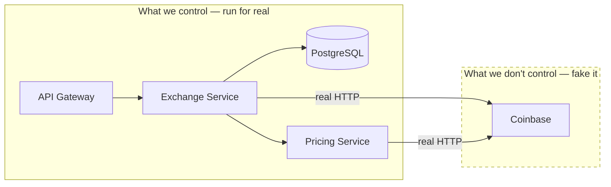
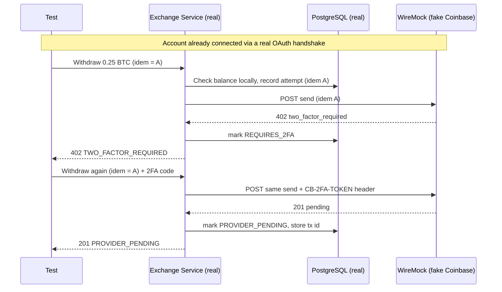

# How we end‑to‑end test a Coinbase 2FA withdrawal by faking only Coinbase

> **Mock the world you don't control. Run everything you do control.**

This document explains the *idea* behind the tests in this repository — not the code, but the thinking. The running example is the hardest, most realistic flow in the suite: connecting a Coinbase account and withdrawing crypto through Coinbase's two‑factor‑authenticated "Send Crypto" API.

The goal is a test that is **as close to production as possible**, while never touching the real Coinbase, real money, or the internet. We get there by drawing one careful line: the boundary of what we own.

---

## 1. The one line that matters: what do we control?

Every system has a trust boundary — a line between the code and infrastructure *you* run and the third parties you merely *call*.

- **Inside the line (we control it):** our API gateway, our exchange service, our database, our networking, our OAuth logic, our idempotency rules, our error handling. This is the code we wrote and the behavior we're actually trying to verify.
- **Outside the line (we don't control it):** Coinbase. We can't run Coinbase. We can't send it real withdrawals in a test. We can't depend on its uptime or its rate limits. And we certainly can't let a test move real Bitcoin.

The principle is simple:

> **Run everything inside the line for real. Fake only what's outside it.**

So we mock exactly one thing — Coinbase's HTTP responses — and run *everything else* as a faithful copy of production.



Everything in the solid box is a real container in a real Kubernetes cluster. Only the dashed box is a stand‑in.

---

## 2. Why fake *only* the exchange?

It's tempting to mock more — the database, the message bus, the other services — because mocking is easy and fast. But every mock is a lie you're choosing to believe. Mock the database and you no longer test your SQL, your transactions, or your unique constraints. Mock a service and you no longer test that two services actually agree on a contract.

The bugs that hurt in production live *precisely* at the boundaries we're tempted to mock away: a mis‑routed request, a botched transaction, a service that expected a different JSON shape, an idempotency key that wasn't actually unique in the database.

So we keep all of those real. The only thing we fake is the one boundary we genuinely cannot run ourselves — the third‑party exchange. That's the minimum lie required to make the test hermetic, and no more.

---

## 3. Why the fake is a *network service*, not a code mock

A common way to fake an HTTP call in JavaScript tests is to intercept it in the test process (tools like Nock or MSW). That works when the code making the call lives in the same process as the test.

Here it doesn't. The call to Coinbase is made by a **Go program**, compiled into a container, running in a **different pod, in a Kubernetes cluster**. The test runner (Node/Vitest) is nowhere near it. There is no function to intercept, no module to stub — just a Go process opening a real TCP connection.

> **You cannot intercept, from a Node test process, an HTTP request that originates inside a Go container in Kubernetes.**

So the fake has to live where the real thing would: on the network. We run **WireMock as an ordinary Kubernetes service**, and we point the exchange service's Coinbase URL at it:

```
COINBASE_API_BASE_URL = http://wiremock.e2e.svc.cluster.local:8080/coinbase-api
```

Now the Go service does exactly what it does in production — resolves a hostname, opens a socket, sends a real HTTP request, reads a real HTTP response. It has *no idea* it's talking to a mock. That's the point: the code under test is byte‑for‑byte the production code, using its normal HTTP client, timeouts, and retries. Only the thing answering on the other end is different.

This also gives us a safety net: in test mode the service refuses to start if its Coinbase URL points at a real `coinbase.com` host — so a misconfiguration can never turn a test into a real transaction.

---

## 4. The withdrawal flow, step by step

A Coinbase withdrawal that requires 2FA is a genuinely tricky, real‑world flow. Coinbase won't send money on the first request; it challenges you, and you retry with a code. Modeling that faithfully is exactly why this makes a good example.



Walk through what's real at each hop:

1. **Connect the account.** Before withdrawing, the test connects Coinbase through the *real* OAuth2 flow: our service builds an authorization URL (with PKCE), the "browser" hits our callback, and our service exchanges the code for a token, fetches the user and accounts, and stores it all — encrypted — in PostgreSQL. Coinbase's token/user/accounts responses come from WireMock; everything our service does with them is real.

2. **Local checks first.** When the withdrawal arrives, the exchange service opens a database transaction, looks up the connected account and its stored balance, and validates the request *before* calling out. Ask to withdraw more than the balance and you get a rejection with **zero** calls to Coinbase — because a well‑built service does its own risk checks before touching a money‑moving API.

3. **The real call out.** The service sends a genuine HTTP request to Coinbase's "Send Crypto" endpoint. WireMock, having been told the 2FA rule, answers `402`. Our service records the attempt as "awaiting 2FA" and returns a clean `402` to the caller.

4. **The retry.** The caller sends the same withdrawal again, with the same idempotency key, plus a 2FA code. Our service replays the *identical* request and adds the `CB-2FA-TOKEN` header. WireMock answers `201 pending`. Our service records the provider's transaction and reports it — honestly — as *pending*, not *complete*, because the real Coinbase transfer isn't final yet either.

Everything except Coinbase's four canned responses is the real system doing real work.

---

## 5. Modeling 2FA as a *rule*, not a script

A lazy mock would say "first call returns 402, second call returns 201." That proves almost nothing — it would pass even if our service never sent the 2FA token at all.

Instead we teach WireMock the *actual condition* Coinbase enforces:

- A send request **with** the correct `CB-2FA-TOKEN` header → succeeds (`201`).
- The same request **without** it → is challenged (`402`).

Now the only way to get a success is for our service to genuinely include the header. The test isn't checking call order; it's checking that our code did the real thing. This is the difference between a mock that flatters you and one that holds you accountable.

---

## 6. Proving idempotency — twice over

Moving money must be idempotent: if a client retries, you must not send twice. Two independent guarantees are in play, and the test checks both.

- **Coinbase's idempotency key (`idem`).** We pass the *same* `idem` the caller gave us straight through to Coinbase on both the challenged attempt and the retry — we never invent a new one. This is what makes the retry safe on Coinbase's side.
- **Our own idempotency layer.** Independently, our database enforces one withdrawal per `(account, idem)`. Replay a completed withdrawal and we return the stored result *without* calling Coinbase again. Reuse the same `idem` for a *different* amount and we reject it as a conflict. Neither of these depends on Coinbase — they're our own safety rules, tested against the real database.

We prove all of this by **reading WireMock's request journal**: after the full sequence, Coinbase has received exactly the number of sends we expect (two, not three, not one), the two carried identical business fields, and only the retry carried the 2FA token. The third‑party's request log is a legitimate thing to assert on — a third‑party contract is externally observable behavior, unlike our internal database, which the tests deliberately never inspect directly.

---

## 7. Why this is "as close to production as possible"

Line up what runs in this test against what runs in production:

| Concern | In production | In this test |
| --- | --- | --- |
| The service code | Compiled Go binary in a container | **The same binary and container** |
| Where it runs | Kubernetes | **Kubernetes (kind)** |
| Service‑to‑service calls | HTTP over cluster DNS | **HTTP over cluster DNS** |
| Database | PostgreSQL, real transactions & constraints | **PostgreSQL, real transactions & constraints** |
| OAuth, PKCE, token encryption | Real | **Real** |
| Idempotency & error handling | Real | **Real** |
| Coinbase's HTTP responses | Coinbase | **WireMock** |

Only the last row differs. Everything the test verifies — routing, discovery, transactions, OAuth, idempotency, the 2FA replay — is the genuine article. The single seam is the one you'd *never* want to exercise for real: the third party that moves money.

That's the whole idea. Draw the trust boundary honestly, fake exactly one side of it on the network, and let the rest of the system be itself. What you get is a test you can believe — and a `make e2e` that proves the real thing works, on your laptop, in a few minutes, with nothing but Docker.
