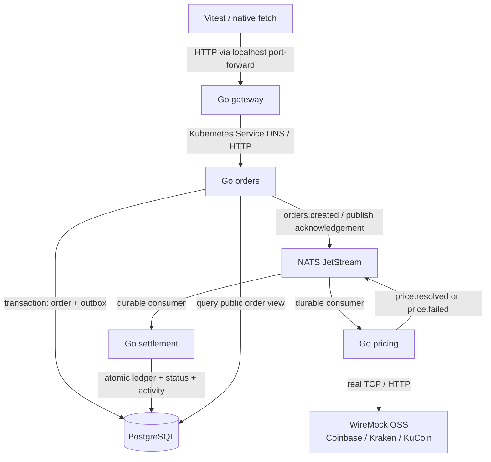
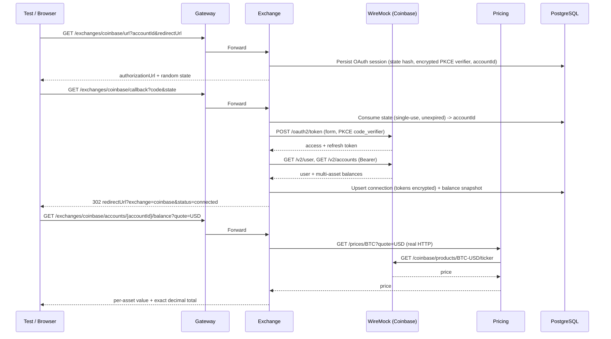

# k8s-e2e-reference

> **Mock the world you don't control. Run everything you do control.**

A complete local reference for testing a distributed Go system through Kubernetes. `make e2e` creates a kind cluster, builds and loads four application images, applies Terraform, runs versioned database migrations, waits for readiness, runs Vitest, and removes the environment. Failures trigger diagnostics **before** cleanup.

This runs real Go binaries, containers, Kubernetes DNS and networking, PostgreSQL, NATS JetStream, migrations, asynchronous consumers, HTTP retries, and health probes. Only Coinbase, Kraken, and KuCoin are mocked, by one WireMock OSS network service. No cloud account, SaaS credentials, Docker Compose, or host database is needed.

## Quick start

Install these tools and start Docker:

| Tool | Reference version |
| --- | --- |
| Docker Engine / Docker Desktop with BuildKit | 29.x (Linux containers) |
| kind | 0.33.0 |
| kubectl | 1.35.0 |
| Terraform | 1.14.7 |
| Go | 1.27.1 |
| Node.js / npm | Node 24, npm bundled with Node (Node 22+ supported) |
| GNU or BSD make, Bash, curl | System tools |

On macOS, `brew install kind kubectl terraform go node` is one installation option. Terraform must be at least 1.14.0. See the official [kind installation instructions](https://kind.sigs.k8s.io/docs/user/quick-start/) for your platform. Windows users should run this repository inside WSL2 with Docker integration.

Allocate roughly 4 CPUs, 6 GB RAM, and 10 GB free disk to Docker. The first run needs internet access to download public tool dependencies and container images. **The running test system has no external infrastructure dependencies beyond Docker.** Subsequent image builds use BuildKit caches.

```bash
git clone https://github.com/florian-sabani-mesh/k8s-e2e-reference k8s-e2e-reference
cd k8s-e2e-reference
make e2e
```

The fixed cluster name is `terraform-k8s-e2e-reference`; the namespace is `e2e`. Kubeconfig and Terraform state live under ignored `.run/`. Your normal kubeconfig/current context is not changed. Test port-forwards bind only to `127.0.0.1`: gateway `18080`, WireMock `18081`, NATS `14222`. Diagnostics temporarily use `18082`.

```bash
make help
KEEP_CLUSTER=1 make e2e                 # Keep the environment after success or failure
SKIP_BUILD=1 make e2e                   # Reuse already-built local images
KEEP_CLUSTER=1 E2E_FILTER=happy-path make e2e
make test-e2e E2E_FILTER=coinbase-retry  # Existing healthy environment
make diagnostics
make destroy
make check                             # Go tests/race/vet, fmt, Terraform validate, tsc
```

Step-by-step operation uses the same scripts as the full lifecycle:

```bash
make cluster
make build
make load-images
make infra       # PostgreSQL -> migration Job -> application deployments
make wait-ready
make test-e2e
make destroy
```

## System and boundaries



The gateway exposes `POST /orders` and `GET /orders/{id}`. Orders owns intake and the outbox. Pricing owns provider-specific HTTP contracts and retries. Settlement owns the business effect. Each service has its own Go module, executable, Dockerfile, and internal package; it can be built independently with `GOWORK=off go build ./cmd/server` from its directory.

The small `pkg/events` module defines the versioned wire envelope. `pkg/runtime` contains process lifecycle, probes, and JetStream plumbing, with no repositories or business services. The root Go workspace is only a developer convenience; container builds explicitly disable it.

This example deliberately shares one PostgreSQL database for orders and the settlement ledger. Only orders and settlement access it; pricing and gateway do not. Shared order lifecycle writes are an explicit teaching simplification, not a claim that all microservices should share a database.

### Happy-path sequence

```mermaid
sequenceDiagram
    participant C as Client / Vitest
    participant G as Gateway
    participant O as Orders
    participant D as PostgreSQL
    participant N as NATS JetStream
    participant P as Pricing
    participant W as WireMock
    participant S as Settlement
    C->>G: POST /orders (X-Test-ID)
    G->>O: Forward HTTP
    O->>D: BEGIN; order PENDING + outbox; COMMIT
    O-->>C: 202 {id, status: PENDING}
    O->>N: Outbox publishes orders.created
    N-->>O: Publish ACK
    O->>D: Mark outbox published
    N->>P: Deliver to pricing-v1
    P->>W: GET exchange ticker (X-Test-ID, X-Order-ID)
    W-->>P: 200 price
    P->>N: price.resolved; wait for publish ACK
    P->>N: ACK orders.created
    N->>S: Deliver to settlement-v1
    S->>D: Atomic activity + unique ledger + SETTLED
    S->>N: ACK price.resolved
    C->>G: Poll GET /orders/{id}
    G->>O: Forward HTTP
    O->>D: Read public order view
    O-->>C: SETTLED + settlement + activity
```

`PRICE_RESOLVED` and `SETTLED` are recorded in the activity timeline in the same settlement transaction. The intermediate database status is intentionally not observable outside that transaction. A client sees `PENDING` followed by `SETTLED` or `FAILED`.

Example request:

```bash
# With a retained environment:
KUBECONFIG="$PWD/.run/kubeconfig" kubectl -n e2e port-forward svc/gateway 18080:8080
# In another terminal (install a matching WireMock stub first):
curl -i http://127.0.0.1:18080/orders \
  -H 'Content-Type: application/json' -H 'X-Test-ID: manual-example' \
  -d '{"asset":"BTC","currency":"USD","amount":"0.1","exchange":"coinbase"}'
```

Amounts and prices are decimal strings. Validation rejects negative values, zero, exponent notation, and excessive precision; PostgreSQL `numeric` performs settlement arithmetic without floating-point rounding. A settlement is a local ledger entry, not an actual cryptocurrency trade.

## Why WireMock is a Kubernetes network service

**Node-process HTTP interception cannot intercept requests originating from Go containers inside Kubernetes.** MSW, Nock, or a Vitest `fetch` mock would affect the test runner, not the pricing process. The pricing service uses the standard Go HTTP client to resolve a Kubernetes Service name and send real TCP/HTTP traffic to WireMock.

Terraform sets all three provider URLs explicitly:

```text
COINBASE_BASE_URL=http://wiremock.e2e.svc.cluster.local:8080/coinbase
KRAKEN_BASE_URL=http://wiremock.e2e.svc.cluster.local:8080/kraken
KUCOIN_BASE_URL=http://wiremock.e2e.svc.cluster.local:8080/kucoin
```

There are no default public upstreams. With `APP_MODE=e2e`, startup rejects any URL other than the exact WireMock service/path. Redirects are never followed and proxy environment variables are not used, preventing a stub from redirecting the client to a real provider. This is application-level protection, not a cluster-wide egress firewall. No DNS monkey-patching or fake HTTP transports exist.

The TypeScript helper supports exact or regex paths, query/header matchers, body/JSONPath matching, JSON/text responses, headers, delays, scenario state, sequential responses, request counts, and independent resets of mappings/history/scenarios. Tests scope stubs and verification to unique `X-Test-ID` values.

```ts
await coinbase.sequence(tickerMatch(id), [
  { status: 503 },
  { status: 503 },
  { status: 200, json: { price: '67500.00' } },
]);
// Create order, eventually assert SETTLED, then:
await coinbase.verify(tickerMatch(id), 3);
```

The helper maps to WireMock's documented [request matching](https://wiremock.org/docs/request-matching/) and [stateful scenarios](https://wiremock.org/docs/stateful-behaviour/). The last sequential response remains active, so an accidental extra retry is observable as an excessive request count.

## Delivery, retries, and failure behavior

| Boundary | Behavior |
| --- | --- |
| Order transaction → NATS | Transactional outbox. Order and event commit together. Publish is marked complete only after JetStream ACK. |
| Outbox crash after publishing | Same event ID is republished. JetStream deduplicates for two minutes; settlement's permanent business key remains the final protection. |
| Pricing | Durable explicit-ACK consumer. ACK only after a result/failure event has a publish ACK. |
| HTTP transient failure | Up to 3 attempts. Retry transport errors/timeouts and HTTP 429, 500, 502, 503, 504. |
| HTTP timing | 400 ms per request; 100/200 ms backoff. `Retry-After` seconds/date honored up to a documented 1-second local bound. |
| Other status, redirects, invalid JSON/price | No HTTP retry. Publish terminal `price.failed`. |
| Exhausted upstream retry budget | Publish terminal failure; order becomes `FAILED` with a stable `error_code`; no ledger entry. |
| Database/NATS failure or shutdown cancellation | Do not acknowledge successful processing; infrastructure errors redeliver. Shutdown cancellation never creates a terminal business failure. |
| Settlement | Row lock, unique `settlements.order_id`, event receipt, status, and activity commit together before ACK. |

`EXCHANGE_TIMEOUT`, `EXCHANGE_BACKOFF`, and `EXCHANGE_MAX_ATTEMPTS` configure HTTP timing. These short defaults make local fault scenarios practical. Business failures are terminal in this reference: a client submits a new order to try again. There is no hidden background retry after `FAILED`.

JetStream stores events on a PVC, retains them for 24 hours, and uses `pricing-v1` and `settlement-v1` durable consumers. ACK wait is 15 seconds and each consumer has one message in flight. Infrastructure errors use delayed negative acknowledgement; retries are unlimited, so failures remain visible instead of silently exhausting delivery. Invalid envelopes are terminated and logged. A production extension would add quarantine/dead-letter handling and alerting.

The permanent settlement key handles redelivery even after broker deduplication expires. Distinct duplicate results appear as `DUPLICATE_IGNORED` in the public activity timeline; the settlement ID, total, and count stay unchanged. HTTP order creation itself is not idempotent: submitting `POST /orders` twice creates two orders.

## Test strategy

Tests run serially because WireMock mappings and journal are shared. Each test resets WireMock, generates UUIDs, and uses unique business records. Tests have no ordering dependency and can run individually. No database truncation is needed.

Assertions use `expect.poll()` with a deadline, never a fixed sleep to guess when settlement finished. Poll failures include the last public order representation, and diagnostics identify which step stalled. Short shell sleeps are exclusively bounded readiness polling.

The public `GET /orders/{id}` response exposes settlement identity/count and an activity timeline, making duplicate-effect assertions possible without SQL. Ordinary success/failure checks never query PostgreSQL. WireMock's request journal is a supported external contract observable. Only fault-injection tests access NATS management/publication or Kubernetes to create a duplicate or restart a process; final business assertions still use the gateway.

| Scenario | Evidence |
| --- | --- |
| Happy path | `SETTLED`, exact decimal total, one settlement, expected upstream request |
| 503 → 503 → 200 | `SETTLED`, exactly three real requests |
| Upstream timeout | WireMock response exceeds real Go timeout; terminal timeout code and no settlement |
| Malformed response | Visible failure, no settlement, next valid order still succeeds |
| Duplicate event | Two created events processed, duplicate ignored, one unchanged settlement |
| Service restart | Queued delivery survives losing the only consumer to a forced pod deletion, then settles once on the replacement pod |

## Exchange service: Coinbase OAuth, portfolio, and withdrawals

The `exchange` service is a second vertical slice that connects a Coinbase account over OAuth2, reads its multi-asset balances, values the portfolio in USD, and performs crypto withdrawals — all through the same "mock only what you don't control" boundary. Coinbase is represented solely by WireMock; the Go pod makes real HTTP calls to it, persists to the real PostgreSQL, and prices assets by calling the **pricing service over real Kubernetes HTTP**. It never imports pricing logic.

Our public API calls the money-moving operation a "withdrawal", but the Coinbase adapter implements it with the **Send Crypto** API (`POST /v2/accounts/:id/transactions`, `type: send`), the endpoint associated with `wallet:transactions:send`, the `idem` key, and Coinbase's documented 2FA replay. Kraken and KuCoin are intentionally unimplemented and return a normalized `UNSUPPORTED_EXCHANGE`.



Withdrawal with Coinbase's 2FA replay and our own idempotency:

```mermaid
sequenceDiagram
    participant C as Client
    participant X as Exchange
    participant D as PostgreSQL
    participant CB as WireMock (Coinbase)
    C->>X: POST withdrawals {idem, 0.25 BTC, to, network}
    X->>D: Lock account; local balance check (0.25 <= 1.5 BTC)
    X->>CB: POST /v2/accounts/btc/transactions (idem)
    CB-->>X: 402 two_factor_required
    X->>D: status = REQUIRES_2FA
    X-->>C: 402 TWO_FACTOR_REQUIRED {retryable, idem}
    C->>X: POST withdrawals {same idem, + twoFactorCode}
    X->>CB: POST same request + CB-2FA-TOKEN
    CB-->>X: 201 {status: pending, id}
    X->>D: status = PROVIDER_PENDING, provider tx id
    X-->>C: 201 PROVIDER_PENDING
    C->>X: POST withdrawals {same idem again}
    X-->>C: 200 stored result (no Coinbase call)
```

Key design decisions:

- **`accountId` is bound through OAuth state server-side.** The `/url` response echoes the caller's internal `accountId`, but the authorization uses a fresh 32-byte random `state`; only its SHA-256 hash is stored, alongside the `accountId`. The callback resolves the binding from the persisted session and never trusts an `accountId` query parameter, defeating callback tampering and CSRF. State is single-use (an atomic `UPDATE ... RETURNING`) and expires (10 min).
- **PKCE (S256).** Each authorization generates a random `code_verifier`; the URL carries `code_challenge = base64url(SHA256(verifier))` and `code_challenge_method=S256`. The verifier is stored encrypted and replayed only at token exchange.
- **Tokens are encrypted at rest** with AES-256-GCM; the key comes from a Kubernetes Secret. Access/refresh tokens, the client secret, the PKCE verifier and 2FA codes are never logged and never returned by the public API or in the redirect.
- **Amounts are decimal strings end to end** (`shopspring/decimal` in Go, `NUMERIC` in PostgreSQL, JSON strings on the wire). `1.5 BTC × $60,000 = $90,000` is exact; the suite asserts exact strings, never float tolerances.
- **Insufficient-balance validation is local.** The service compares the request against the persisted balance snapshot and returns `422 INSUFFICIENT_BALANCE` **without any Coinbase call** — proven by an empty WireMock Send journal.
- **Send Crypto, not fiat withdrawal**, because this is the OAuth + `idem` + 2FA endpoint the sample is about.
- **2FA retry reuses the same `idem`.** The business-request fingerprint deliberately excludes the 2FA code, so "same idem, no 2FA" and "same idem, with 2FA" share one fingerprint; the second attempt replays the identical Send request plus a `CB-2FA-TOKEN` header. Our own idempotency layer (`UNIQUE(cex_account_id, idem)`) returns the stored result on replay and rejects a changed payload with `409 IDEMPOTENCY_CONFLICT` — independent of Coinbase's `idem`.
- **Money movement is treated more conservatively than reads.** `GET` calls (user, accounts) retry transient failures; the Send is never retried automatically, even though `idem` would make it safe. Retries there are the caller's explicit choice.
- **Provider `pending` is not "completed".** A successful Send whose provider status is `pending` maps to `PROVIDER_PENDING`, preserving the truth that the on-chain transfer is not final.

The exchange endpoints all pass through the gateway boundary; the callback is routed there too. In `APP_MODE=e2e` the service refuses to start if any Coinbase endpoint resolves to a public `coinbase.com` host — an application-level guard against accidental real-money calls.

| Exchange scenario | Evidence |
| --- | --- |
| OAuth URL | 200 with PKCE `S256`, random `state` ≠ `accountId`, correct scopes |
| OAuth callback | 302 to `redirectUrl`; exactly one real token/user/accounts request each |
| Invalid state | `400 INVALID_OAUTH_STATE`; token endpoint never called |
| State replay | `409 OAUTH_STATE_ALREADY_USED`; still one token exchange |
| USD portfolio | Exact `$97,000.00` total via the pricing service; per-asset decimals |
| Insufficient balance | `422 INSUFFICIENT_BALANCE`; **zero** Coinbase Send calls |
| Withdrawal 2FA | First Send → `402`; our `402 TWO_FACTOR_REQUIRED`; one Send |
| 2FA replay | Same idem + code → `201 pending`; exactly two Sends, second carries `CB-2FA-TOKEN` |
| Idempotent replay | Same idem again → stored result; Send count stays two |
| Idempotency conflict | Same idem, changed amount → `409 IDEMPOTENCY_CONFLICT`; no Send |

## Terraform and kind

kind creates the Kubernetes cluster **before** Terraform runs. The Kubernetes provider needs a reachable API server during planning and applying; making it create its own provider target obscures bootstrap and teardown ordering. Terraform owns the namespace, services, config maps, secret, PostgreSQL and NATS StatefulSets/PVC templates, WireMock and Go Deployments, probes, resource requests/limits, and migration Job.

PostgreSQL readiness precedes the migration Job. The migrator takes a PostgreSQL advisory lock, tracks checksums and applied versions, and applies each SQL file transactionally. The Job name includes the migration checksum; deployments wait for successful completion. Add a new numbered SQL file rather than editing an applied migration.

PVCs survive pod replacement within the cluster; deleting the kind cluster intentionally discards everything. This is a local disposable environment, with a documented throwaway database password. Terraform state contains that password and is ignored by Git. No real credentials are included. Services run as non-root, without service-account tokens, with read-only root filesystems and dropped capabilities. The upstream infrastructure images retain the filesystem permissions they need.

## Diagnostics and debugging

`make e2e` traps errors and termination signals. It collects diagnostics before destroying resources and preserves the original failure exit code. `KEEP_CLUSTER=1` retains the environment for interactive investigation. Run `make destroy` when done.

Artifacts include:

- all pods with restart counts and readiness state;
- pod descriptions, probe failures, Kubernetes events, deployments, jobs, and PVCs;
- current and previous logs from every pod, including migrations and infrastructure;
- WireMock request history, unmatched requests, scenarios, and mappings;
- JetStream stream and consumer state;
- Vitest JUnit results and a per-failed-test WireMock snapshot captured before the next reset;
- port-forward logs.

Application logs are JSON with `service`, `order_id`, `correlation_id`, `event`, `exchange`, and `attempt` where relevant. `X-Test-ID` travels HTTP → order/outbox → event → pricing → exchange request → result → settlement.

```bash
export KUBECONFIG="$PWD/.run/kubeconfig"
kubectl -n e2e get pods
kubectl -n e2e logs -l app=pricing --tail=100
kubectl -n e2e logs -l app=settlement --tail=100
make diagnostics
```

## CI and repository map

GitHub Actions installs the same prerequisites, runs static checks, then calls `make e2e`. It uploads `artifacts/` even on failure and makes a final cleanup attempt. Local and CI tests use identical Terraform and Vitest code.

```text
.github/workflows/e2e.yml     CI running the local workflow
services/
  gateway/                   HTTP routing (orders + exchange) and upstream readiness
  orders/                    Order API, transactional outbox, migration executable
  pricing/                   Provider clients, durable consumer, /prices HTTP endpoint
  settlement/                Atomic, idempotent settlement consumer
  exchange/                  Coinbase OAuth, portfolio valuation, withdrawals + 2FA
pkg/events/                  Versioned JSON event contract
pkg/runtime/                 Logging, graceful HTTP shutdown, JetStream plumbing
migrations/                  Ordered SQL migrations
infra/modules/               microservice, postgres, nats, wiremock
infra/environments/e2e/       Provider, dependencies, migrations and app wiring
kind/cluster.yaml            One local Kubernetes node
hack/                        Shared lifecycle, readiness, checks, diagnostics
 e2e/support/                API, eventual assertions, WireMock, fault helpers
 e2e/scenarios/              Black-box business and recovery scenarios
```

## Troubleshooting and scope

- **Docker unavailable:** start Docker Desktop/Engine and check `docker info`. On Linux, ensure your user can access the Docker socket.
- **Pods Pending / image pulls slow:** check `make diagnostics`; give Docker more memory/disk and allow public registry downloads. CPU or Java startup constraints appear in events/probes.
- **Port already in use:** free 18080, 18081, 14222, and 18082. A failing forward prints its log rather than silently connecting to an unrelated process.
- **Missing tables:** inspect the migration Job and its logs. Application rollout is blocked until it succeeds.
- **Order PENDING:** inspect outbox logs, NATS consumer state, pricing errors, and WireMock unmatched requests using its test correlation ID.
- **Cluster retained after an interruption:** `make destroy` removes this repository's environment. `.run/cluster-owned` prevents accidental adoption/deletion of a pre-existing cluster of the same name.
- **Stale lifecycle lock after SIGKILL:** confirm no lifecycle process is active, then remove the empty `.run/e2e.lock` directory with `rmdir`. Normal failures and Ctrl-C remove it automatically.
- **Changes in a retained cluster:** rebuild/load images and use a new `IMAGE_TAG` for `make infra`, or destroy and run `make e2e` for a guaranteed fresh environment. Kubernetes does not automatically restart a pod when a mutable local image tag changes.

This is a production-quality **testing reference**, not a production trading deployment: one replica per component, local unauthenticated NATS/HTTP, a throwaway database account, no ingress/TLS, no real funds, no backups, and no public access. Real deployments would add authentication, least-privilege database roles, HA, TLS, outbox/event retention policies, and alerting. Those additions should preserve the tested network boundaries and delivery guarantees.
